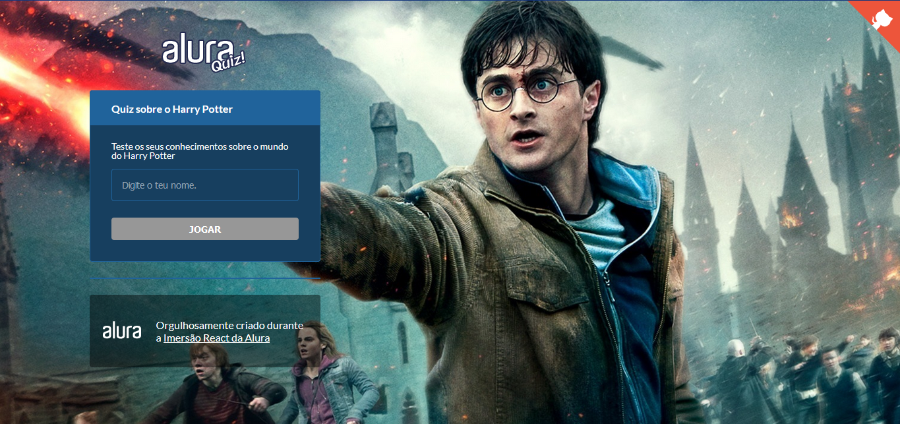
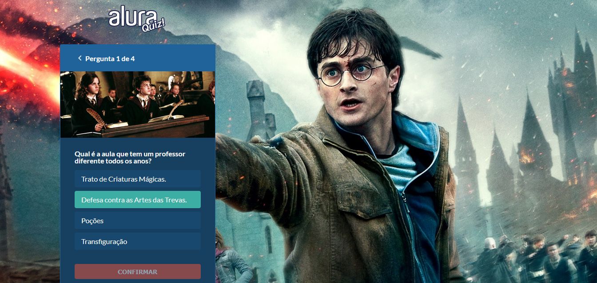

<h2 align="center">
   Harry Potter Quiz
</h2>

https://github.com/KarinaRovani/aluraquiz-harrypotter/assets/37753278/a64c6835-6988-4258-9025-70aa2f84f755

# About
Quiz in React and Next.Js with questions in Portuguese about Harry Potter

Project Imersão React Next.js from Alura

You can see this application working in real time over here (Portuguese): https://aluraquiz-harrypotter.karinarovani.vercel.app/

# Tools
- React
- Next.js
- CSS
- Javascript
- styled-components
- eslint
- prop-types
- framer-motion
- 
## Layout
<figure>

  
  <figcaption>Home Page</figcaption>

</figure>
 
<figure>

  
  <figcaption>Question</figcaption>

</figure>
 
<figure>

  
  <figcaption>Question Answered Correct</figcaption>

</figure>
 
<figure>

  
  <figcaption>Result of the Quiz</figcaption>

</figure>
 

<h5 align="center">
  &copy;2021 - <a href="https://github.com/KarinaRovani/">Karina de Oliveira Rovani</a>
</h5>
